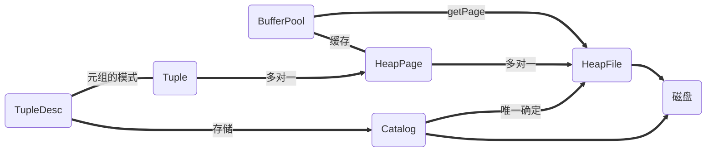

# Lab1 

> 开始时间：2022/4/5
>
> 结束时间：2022/4/6
>
> 文档撰写时间：2022/11/7

lab1 主要是实现了整个数据库的底层存储架构，做完 lab1 我们会知道元组、表、堆文件页是如何组织并联系起来的、以及是以什么样的格式在磁盘上存储，按照讲义上的提示，lab1 中我们将：

- 实现类来管理元组，即 Tuple。官方已经实现了 Field，包括 整数字段、字符串字段。所以我们只需要存储这些固定长度的元组。
- 实现目录（Catalog），目录是表的元数据管理类，可以通过表名或表 ID 向目录请求唯一的堆文件，堆文件中是访问磁盘上页面的入口，一个页面存储者若干个元组。
- 实现 BufferPool 构造函数和 getPage（） 方法，这会调用堆文件进行读取。
- 实现访问方法、堆页和堆文件以及关联的 ID 类。这些文件的很大一部分具有已经为你写好了。
- 实现运算符 SeqScan，完成全表扫描。

实验的目标是通过 ScanTest 系统测试。

lab1 涉及的类主要有：

- **Tuple**，元组，存储着字段数组，一个字段包括类型与字段的值。
- **TupleDesc**，表或元组的模式，包括元组中每个字段的类型与名称。
- **HeapPage**，内存中的数据页，包括页头与一系列元组，页头中存在 bitset 指示元组是否有效。
- **HeapFile**，Dbfile 的实现类，页与磁盘的交互，一个表唯一对应一个 HeapFile，HeapFile 可读取或写入磁盘上的页。在 Simpledb 中，可以将 Dbfile 当成一个 table。
- **Catalog**，表与 DbFile 的关系，Catalog 中存储着表的名称和表的模式（可存储多个表），通过表的名称唯一定位一个 Dbfile、元组模式等信息，Simpledb 中为表赋予了逻辑上的一个 ID，亦可通过 ID 获取 Dbfile、元组模式、表名等信息。
- **BufferPool**，页面缓冲池，对外开放的 HeapPage 入口，当缺页时，需要调用 HeapFile 从磁盘中读取。
- **SeqScan**，全表扫描，使用 BufferPool 获取所有页，在页中获取所有元组。

整体的联系如下图：



## 练习一

联系一要求实现 `src/java/simpledb/storage/TupleDesc.java` 和 `src/java/simpledb/storage/Tuple.java` 两个类，相对而言还是比较简单的，理解整体架构即可。

Tuple 类还需要我们实现一个字段的迭代器，将其转换为 List 返回迭代器即可。

在实现中，暂时不清楚为什么允许存在**匿名字段**，可以作为思考的一个点。

## 练习二

练习二要求我们实现 `Catalog` 类，Catalog 由当前表的列表和表的模式组成。您将需要支持添加新表的功能，以及根据表 ID 或表名称获取有关的特定表。

从 `loadSchema` 方法我们可以看到，Catalog 文件中的每一行都代表了一个表的模式，每一行的格式大概就像：

```c
tableName (fieldName fieldType pk, fieldName fieldType, fieldName fieldType, ....)
```

其中 pk 是主键字段，`loadSchema` 读取表的模式，并构造 `TupleDesc`。

一个 tableName 可以唯一对应一个 Dbfile，每个表的数据文件独立存储，一个 Dbfile 有一个 ID，这个 ID 作为表的 ID，可以通过这个表的 ID 向 Catalog 请求特定的表。

我并不清楚为什么需要这个 ID，在我看来 tableName 就足以去标识一个 Dbfile 了，官方建议我们使用 `Dbfile.getAbsolutePath().hashCode()` 作为 ID，但这可能会存在**哈希碰撞**，也许我们需要做完整个实验才会得到答案。

## 练习三

实现缓冲池的 `getPage()` 方法，实验一中暂时不需要管驱逐策略以及事务权限等，当页面不在缓冲池中，我们只需要调用 HeapFile 进行 read 即可。

在 Simpledb 中，BufferPool 不仅仅作为页面的缓存，它还允许事务以特定的权限读取页面，并提供了一组接口供事务释放权限。

## 练习四

练习四需要实现：

- src/java/simpledb/storage/HeapPageId.java
- src/java/simpledb/storage/RecordId.java
- src/java/simpledb/storage/HeapPage.java

主要是 HeapPage 类的实现，这个类是数据页在内存中的展示，可以通过内存页插入删除元组，当然这不是实验一的内容，实验一只需要我们理解页在磁盘中组织的方式，并且返回一个迭代器以遍历一个页中的元组。

一个数据页主要由两部分组成：页头 和 一些元组。页头是一个 bitset，每一位指示者对应的元组是否有效，

那么一个页最多可以容纳几个元组呢？设页的大小为 PageSize、元组大小为 TupleSize，每个元组需要额外的一个 bit（1/8 byte）标识，那么假设容纳 x 个元组：
$$
(TupleSize + \frac18)  \times x <= PageSize
$$
因此最多可以容纳 $floor(\frac{PageSize \times 8}{(TupleSize \times 8 + 1)})$ 个元组。

这里有一点需要注意，由于在内存中 header 是以字节数组存储的，假设页中只有一个元组，仅需要 1bit 的页头，这意味着 header 字节数组中最后一字节可能会有一些 bit 位是无意义的。

## 练习五

练习五需要实现 HeapFile 类，实验一中仅需我们根据页号从磁盘中读取页，而暂时不用管写入，这个不难实现，使用 `RandomAccessFile` 类加指针偏移即可实现，要注意做好边界判断即可。

除此之外，还需要实现一个迭代器实现全表扫描，不过要注意**页面应该从缓冲池中获取**，扫描时也要注意，可能**某些页中的元组是无效的**，甚至可能会存在**空页**！我们应该循环迭代到下一个有效的元组。

**在实验一中，我们暂时不需要关注权限的问题，可以以只读的权限获取页面，但要留个心，看看后面的实验释放有释放的逻辑。**

这里要思考一下，在 HeapFile 类中实现迭代器是否符合设计要求，HeapFile 是与磁盘打交道的类，而迭代器又要求从缓冲池读取页，这似乎有些不合理之处。

## 练习六

实现 SeqScan 运算符的逻辑，SeqScan 将无顺序的扫描所有的数据，直接调用练习五中的迭代器即可。

对比来看，在 Mysql 中全表扫描会使用主键的 B+ 树进行顺序扫描，因此返回的结果大多是按主键有序的。但在某些对顺序无感的情况下，在数据页中的全表扫描会更快一些，因为**读取几乎总是顺序的**。
