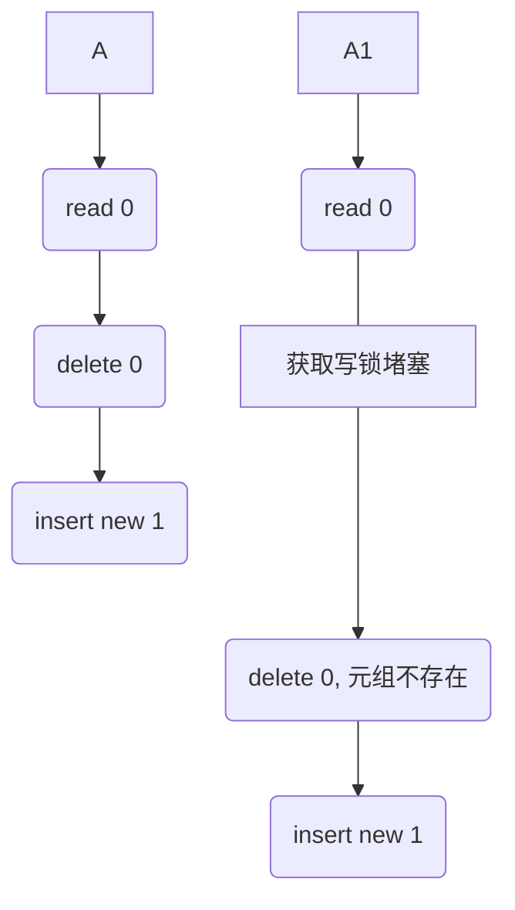

# Lab4

> 开始时间：2022/11/10
>
> 结束时间：2022/11/11
>
> 文档撰写时间：2022/11/11

Lab4 要求我们完成事务的原子性、隔离性、持久性，这需要锁来保证。

在 Simpledb 中，实现的是一种非常简单的表级锁，事务获取页面时以 `READ_WRITE` 模式锁定页面，并在事务结束时统一释放页面，即使是查询运算符，它也需要以写模式锁定页面。这是非常悲观的策略，同时性能也是比较糟糕的，但实现起来非常简单。

这是让人费解的一件事情，`SeqScan` 运算符（它调用了 `HeapFile` 的迭代器）理应以只读模式锁定页面，但是如果这样做可能无法通过系统测试 `TransactionTest`。

这个测试启动两个（也可以是多个）线程，并且有一个表，这个表中只有一个元组，字段值为 0，线程同时运行，每个线程以不同事务查询表中元组、将元组字段值自增，删除原先的元组，然后插入新元组。测试系统会比较最终元组的值是否与线程数相等。

试想如果查询能以读模式运行，那么两个线程可能会同时读到旧的值 0，最后的元组的值将为 1 而不是 2.



上图演示了这种情况，因此即使是读取，也需要采用写模式锁定页面，否则将无法通过测试，而且也会导致**不可重复读、幻读**等现象，在 Mysql 中它通过 `MVVC` 和间隙锁避免。

在这种规则下，回滚操作变得非常容易，由于页面被事务唯一锁定，当事务回滚时，我们丢弃事务锁定的页面，这会导致从磁盘重新读取新的、干净的页，从而实现归滚操作，保证原子性。

除了锁定，持久化在这里也是简化过了的，通常数据数据库会存在几种存储模式：

- NO_STEAL/STEAL
  - NO_STEAL：非窃取模式，这种模式不允许缓冲池将由未提交事务锁定的页面落盘。换句话说，一旦页面落盘，页面上的事务一定是已提交的，不需要回滚。内存中的回滚不需要 `undo log`，它可以简单的保存锁定之前的数据用以恢复。
  - STEAL：窃取模式，页面可能在任何时候落盘，即使有事务在引用它。STEAL 模式需要 `undo log` 来保证宕机恢复时，能够回滚未提交的事务。这种策略比较灵活，避免事务提交时一次性落盘大量页面从而导致堵塞。
- NO_FORCE/FORCE
  - NO_FORCE：非强制模式，事务提交时不需要立即将页面落盘。这种策略也很灵活，由数据库决定何时刷新缓存，例如缓存不足时、数据库关闭时......在 Mysql 中这些被称为检查点。由于内存页面可能丢失，因此需要 `redo log` 来保证宕机恢复。
  - FORCE：强制模式，事务提交时强制落盘页面，不需要 `redo log`，但单个事务的性能可能会很差。

Simpledb 中使用 NO_STEAL/FORCE 模式，这是最差的一种模式，讲义说在实验六中会加大难度，虽然这个实验完成起来比较简单，但如果仔细思考，确实也能让我们学习到不少。

## 练习一

实现 `BufferPool` 中的获取锁、释放锁。

最初，我尝试过直接在 `Page` 接口内增加读写锁的方法，然后在**页面对象**上锁定。但是当我做到后面的练习时，我发现这是不对的，Simpledb 中的对于页面的驱逐是非常简单的，由于使用了 NO_STEAL 模式，所以我们不能驱逐任何脏页，因为它已经被页面修改，**我们需要选取一个干净的页面驱逐**。而一旦事务提交，所有页面会强制落盘。

这里会有一个问题：**如果事务锁定了页面，但是在页面弄脏他之前，缓存驱逐了这个页面，此时其他线程读取页面就会创建一个新的对象**，这是不对的，页面对象发生了改变，锁也就没有了意义。

最简单的解决方案是缓存在驱逐页面时，必须获得页面上的写锁，这能保证不会有其他事务引用它。这样的问题在于，无法通过系统测试，因为讲义要求我们淘汰干净的页面即可。

那么，如果事务引用的页被驱逐了，随后事务又修改了这个僵尸页面该怎么办呢？在之前的 lab 中，官方似乎告诉了我们答案：


在弄脏一个页面后，**事务强制性覆盖缓冲池现有的页面**。而由于锁定，其他事务无法获取这个页面。

现在，需要实现对页面的锁定，我们需要一个不可变对象完成页面锁定，我实现了一个页面锁池，它将 `PageId` 映射到唯一的 `PageLock`，驱逐策略将获取锁再驱逐，这保证了驱逐后就不会有事务引用它了，如果无法驱逐，则允许短时间超过限制。


现在我们需要实现 PageLock，它应该要实现 `readLock/tryLock/unLock、writeLock/tryLock/unLock、hasLock` 这几个方法，要额外注意的是，**不能使用读写锁，读写锁保存的是线程之间竞争，而在这里是事务之间，在官方的测试中，一个事务可能会有多个线程。**

实现读写锁的方式有多种，我是使用 sync 和条件变量实现的，不管怎么样，锁应该是可重入的。


 

实现了锁之后，还需要一个数据结构跟踪事务 `ConcurrentHashMap<TransactionId, Set<PageLock>> `，有了这个数据结构，我们可以很方便地得知事务在什么页面上持有什么样的锁。

随后一个 `lockPage` 的逻辑应该非常简单，获取 `PageLock`，如果没有，就从池中取出一个新的 `PageLock`，判断给定权限，然后加锁，并放入`ConcurrentHashMap<TransactionId, Set<PageLock>>` 中。最后在 `getPage` 中调用这个方法锁定页面即可。


## 练习二

练习二要求我们检查加锁和释放锁的逻辑，`insert、delete、dbfile` 中都应该以写模式锁定。

除此之外，在插入的逻辑，我之前写了个**遍历页面**查找空页，在这里，如果页面已满，我们需要释放掉这些页面上的锁。

这里有个坑，考虑一个问题，如果原先事务就在这个页面上持有锁呢，这完全是可能的！这时释放锁是不对的，应该要恢复成原先的样子！官方的测试数据似乎有些弱，即使没有这个逻辑也能通过测试。

```java
for (int i = 0; i < numPages; i++) {
    // 页面本身可能会被事务持有锁
    PageLock pageIdLock = pool.getPageIdLock(tid, new HeapPageId(this.tableId, i));
    if (pageIdLock != null) {
        // 这是一个副本，用来判断页面之前是否被事务占用
        pageIdLock = pageIdLock.clone();
    }
    // 以写权限锁定页面，因此接下来对页面的操作都是安全的
    // 不过，这样遍历堵塞获取锁，效率是非常差的，更好的办法是写一个空闲空间管理类
    // 例如一个并发安全的哈希，key 是空闲槽的数目，val 是一系列页的集合
    HeapPage page = (HeapPage) pool.getPage(tid, new HeapPageId(this.tableId, i), Permissions.READ_WRITE);
    if (page.getNumEmptySlots() != 0) {
        page.insertTuple(t);
        return List.of(page);
    }
    // 要记录一下，这里并没有释放锁的逻辑，也没有标记脏页的逻辑
    // lab4 填坑，如果没有修改页面，那么应该释放掉页面上的锁
    // unsafeReleasePage 将释放所有锁，但是如果页面之前就持有锁呢？我们应该要考虑这种情况，所以我们要预先保持事务持有的锁
    else {
        if (pageIdLock == null || (!pageIdLock.hasWriteLock(tid) && !pageIdLock.hasReadLock(tid))) {
            // 没持有锁
            pool.unsafeReleasePage(tid, page.pid);
        } else if (pageIdLock.hasReadLock(tid)) {
            // 进行锁降级
            pool.lockPage(tid, page.pid, Permissions.READ_ONLY);
            pool.unsafeReleasePage(tid, page.pid, Permissions.READ_WRITE);
        }
        // 如果是写锁，那么不需要释放它
    }
}
```

## 练习三

练习三要求我们实现 NO_STEAL 模式，淘汰干净页即可。

有一点需要注意，使用 LinkedHashMap 遍历元素时，要使用 `new ArrayList<>(values).subList(0, values.size() - 1)` 来遍历，这是因为 LinkedHashMap 在逐出时会将我们插入的元素也加入集合中，所以我们要排除这个元素。

为了保证多线程并发安全，在 put 时需要加锁。

## 练习四

实现事务提交或回滚时相关逻辑，需要释放锁，如果是提交，需要强制落盘；如果是回滚，则需要还原成原来的数据，当然由于这里是全表锁定，可以直接抛弃这个页面。

## 练习五

`getPage` 时实现死锁检测，这里就简单的采用超时策略，如果超时则抛出异常。

当然也可以通过其他算法，例如

- 有向图拓扑排序，如果最后存在节点入度不为 0，则存在死锁。
- 有向图递归，使用颜色标记递归过的节点，如果再次递归到了，则存在死锁。